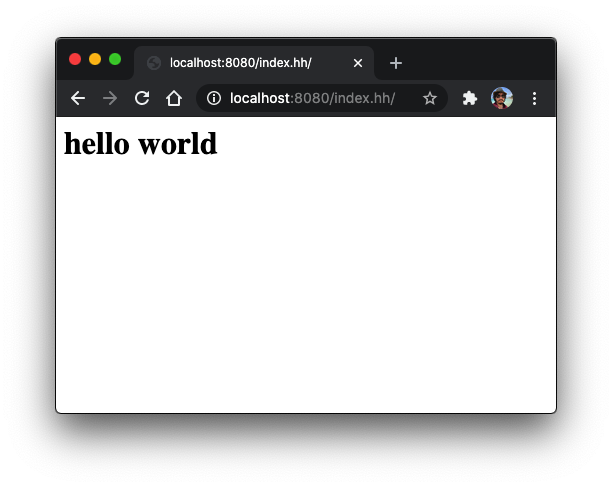
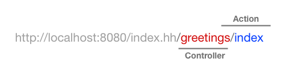
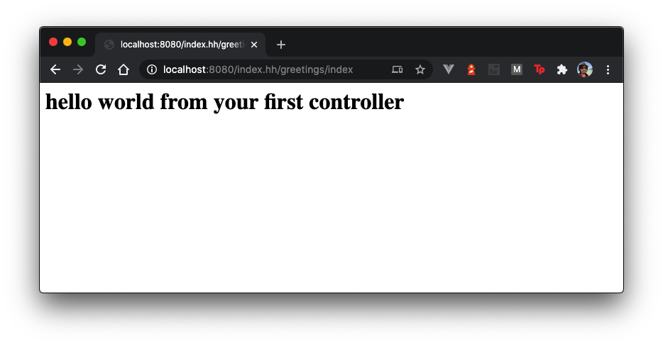
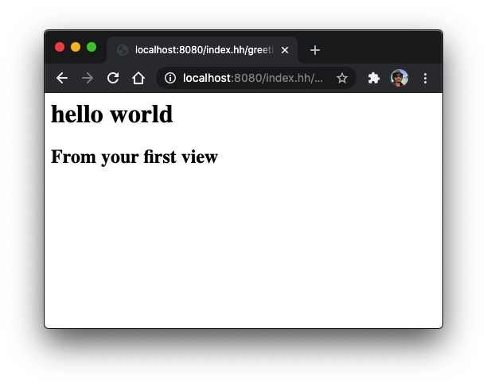
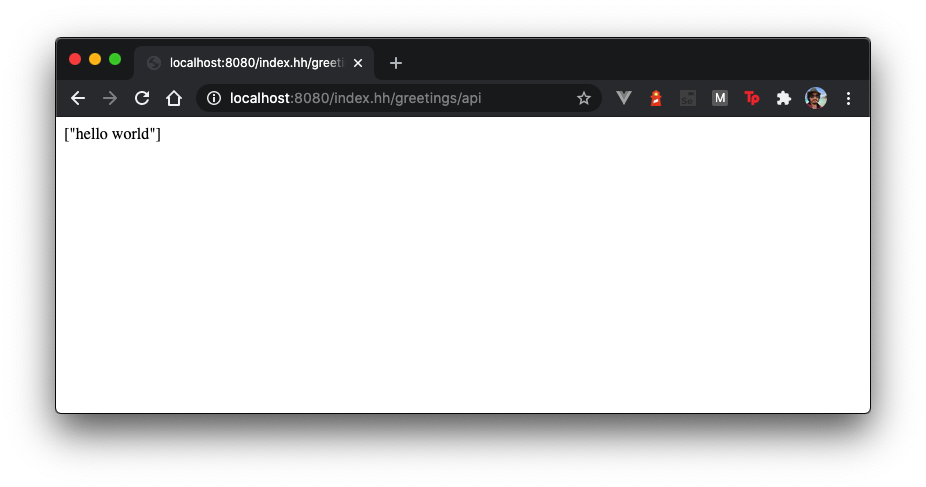

</br>
</br>
</br>

# Discovering Hack 
## How to start building a microframework using hack language

In this tutorial we will learn how to build your first website written completly using Hack.

The objective of this tutorial is to make an extra contribution to existing documentation, to allow more developers to adopt hack in an easier way, through showing a step-by-step tutorial for building your first website using hack.

</br>

**Pre requirements**

- hhvm 4.80.0 or major
- Composer installed

</br>

## Let's begin, as always everything starts with a "hello world"

To write our first hack website we have to create an index.hh file with a main entry point as follows:

```
<<__EntryPoint>>
function main(): void {
  echo "<h1>Hello World</h1>";
}
```

Then run hhvm in server mode, executing `hhvm -m server -p 8080` in your command line located in your the same folder that your script are.

Open your favorite browser, go to "http://localhost:8080/index.hh" and check your brand new website. 



<br/>


## But ... we are going to need manage routes ... 

That is true, let's create a route manager

```
class Router {
  \\ ... 
}
```

Now, we have to save our route params as controller and action names, we are goint to use `index.hh/controller/action` format, on this way we can use `proxy_pass` in our webservers to bypass the requested routes to our application.



To reach this goal we have to preprocess our request uri in order to extract the segments which contains or values.

```php
public function __construct($server) {
 
  $this->query_string = $server["QUERY_STRING"]; 
  $request_url = (isset($server['REQUEST_URI'])) ? $server['REQUEST_URI'] : '';
  $script_url  = (isset($server['PHP_SELF'])) ? $server['PHP_SELF'] : '';
  $url = str_replace('src/index.hh/', '', $script_url);
  $segments = explode('/', $url);

  if(isset($segments[1]) && $segments[1] != '') $this->controller = $segments[1];
  if(isset($segments[2]) && $segments[2] != '') $this->action = $segments[2];

}
```

Now we hava stored our controller and action names in `$controller` and `$action` instance variables.

Finally we have to build an `apply` method to run the routing process when we receive an http request, for this, we just call to the controller method according with the controller and action names as follows:

```php
  public function apply(): void{

    $path = __DIR__ . '/../src/controllers/' . $this->controller . '.hh';

    $controller_name = mb_convert_case($this->controller, MB_CASE_TITLE, "UTF-8") . "Controller";
    $action_name = $this->action;

    if (file_exists($path)) {
      require_once($path); 
        if(!method_exists($controller_name, $this->action)){
          echo "Method not found";
        } else {
          $obj = new $controller_name();
          $obj->$action_name();
        }
    } else {
      echo $path;
       echo "Invalid route";
    }

  }
```

> We recommend save your application files within a `src`folder, to differentiate them from our micro framework files.

<br/>


## Ok, thats sounds good but ... how can I use it?

Ok, first we have to write additional code to our `index.hh` file.

```php
<<__EntryPoint>>
async function main(): Awaitable<void> {

  require_once(__DIR__.'/vendor/autoload.hack');
  require_once(__DIR__.'/lib/router.hh');

  $path = basename($_SERVER['REQUEST_METHOD']);

  $router = new Router($_SERVER);
  $router->apply(); 

}
```

Then you have to create your first controller inside of `src/controllers` folder, and write a simple index method which will be called by the router.

```php
class GreetingsController {

  public function index(): void{
    echo "<h1> Hello World from your first controller</h1>"
  }

}
```

Let's run our server `hhvm -m server -p 8080` and go to `http://localhost:8080/index.hh/greetings/index`



<br/>


## Not bad, But shouldn't it have views?

Sure, lets crete a `views` folders inside our `src` folder.

A neat way to do it would be, create a controller class to contain our helpers methods for our controllers as a 'loadView()' method.

```php
class Controller {

  public function loadView(string $name): View {
		$view = new View($name);
		return $view;
	}
    
}
```

Now we have to create a `View` class to represent our views, we are going to render simple html by now.

```php
class View {
 
	private $template;

	public function __construct(string $template): void {
		$this->template = __DIR__ . '/../src/views/'. $template;
	}

	public function render(): void { 
		$myfile = fopen($this->template, "r");
    echo fread($myfile,filesize($this->template));
	}
    
}
```

Finally, we have to use all of this in our application.

First we use our new helper method in our greetings controller as follows:

```php

class GreetingsController extends Controller {

  public function index(): void{
    $template = $this->loadView('hello.html'); 
		$template->render();
  }

}
```

Then he can write a simple html file inside of our `/src/views` folder.

```html
<h1>hello <b>world</b></h1>
<h2>From your first view</h2>
```

Let's run our server `hhvm -m server -p 8080` and go to `http://localhost:8080/index.hh/greetings/index`



<br/>


## I see, and what about if I want to return a json response?

We can return our json responses from our controller as follows:

```php
class GreetingsController extends Controller {

  public function index(): void{
    $template = $this->loadView('hello.html'); 
		$template->render();
  }

  public function api(): void {
    $greeting = vec["hello world"];
    echo json_encode($greeting);
  }

}
```

If we go to `http://localhost:8080/index.hh/greetings/api`, we will see a json response.



<center>

<p align="center">

  

</p>

</center>


<br/>
<br/>


# What have we learned?

- Now we can understand how hhvm processes http requests.
- We are able to set up a simple web application or API using hack.
- We hope we have motivated you to continue exploring hack.

# What next ?

- We would like to add XHP support in our views
- We would like to add auto detection of routes based on http methods, as listing, create, update, delete.
- We would like to write more useful controller helpers 
- Prepare a packgist package for our micro framework.


